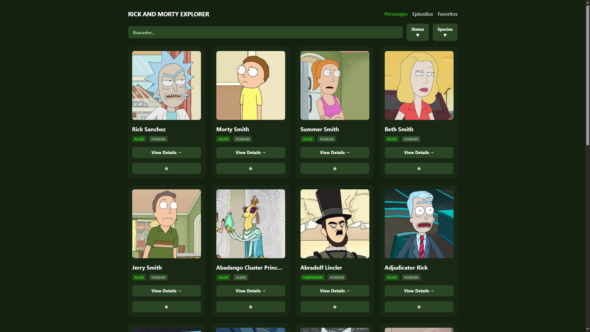

# Rick & Morty Character Explorer

Aplicación web construida con React que consume la API pública de Rick & Morty.
Permite explorar personajes y episodios con filtrado dinámico en tiempo real.

## Demo

[Demo](https://matusbh.github.io/RickMortyApi/#/characters)

## Qué hace

- Consume la API pública de Rick & Morty (rickandmortyapi.com)
- Filtrado dinámico de personajes por nombre, estado y especie
- Gestión de favoritos con persistencia mediante localStorage
- Navegación entre personajes y episodios
- Diseño responsive adaptado a móvil y escritorio

## Stack

- React
- JavaScript
- Tailwind CSS
- REST API
- React Router
- localStorage

## Decisiones técnicas

Se usó React Router para la navegación entre vistas sin recarga de página.
Los favoritos se persisten en localStorage para mantener el estado entre sesiones
sin necesidad de backend. El filtrado es local sobre los datos ya cargados
para evitar llamadas innecesarias a la API.

## Instalación
```bash
git clone https://github.com/Matusbh/RickMortyApi.git
cd RickMortyApi
npm install
npm run dev
```

## Captura

